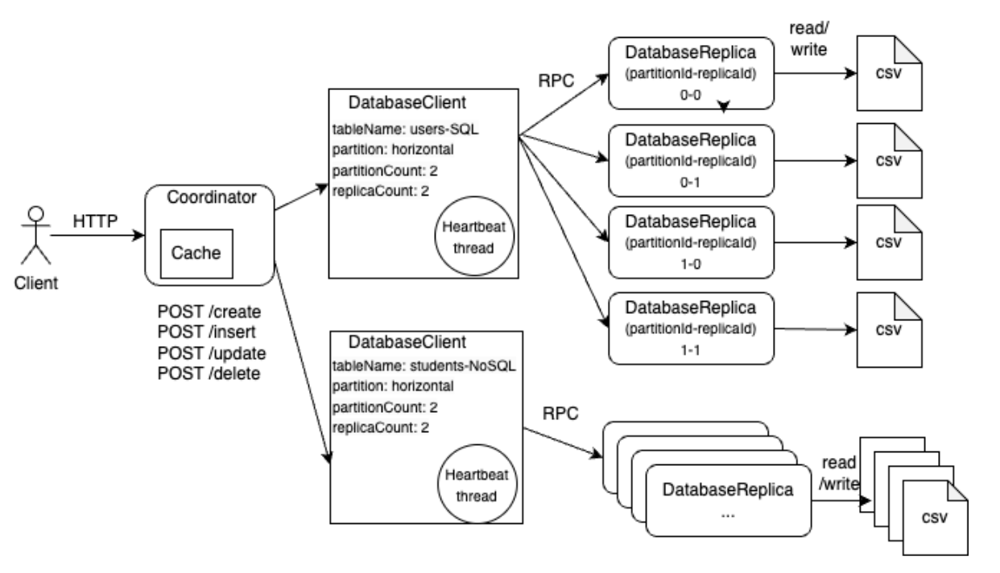

# Distributed Database Platform 

This project is an attempt to develop a distributed database platform that runs locally, using Java. It is designed to mimic the functionality of a full-scale distributed database while being simple enough to run on a single machine. The primary goal is to provide a learning project for understanding the concepts and architecture behind distributed databases.

## Design

Clients interact with our distributed database platform through the HTTP interface of the Coordinator. Upon receiving a table configuration (which includes table name, database type (SQL or NoSQL), partition type, partition count, and replica count), the Coordinator initializes DatabaseClient and DatabaseReplica instances. These instances communicate via the RPC protocol. The DatabaseReplica handles file system read and write operations in CSV format. Please refer to `Appendix 1` for HTTP API documentation.

## Query Languages
The system supports two types of query languages:

SQL: Standard SQL syntax.

NoSQL: A custom query language defined as follows:

- Create Table: CREATE TABLE tableName
- Select: SELECT tableName
- Insert: INSERT tableName id, idValue(int), key1, value1, key2, value2…
- Update: UPDATE tableName key1, value1, key2, value2… WHERE id idValue(int)

There are three limitations to our query languages:
1. Only supports SELECT *.This means it is not possible to select specific columns or use conditions to filter records directly in the query.
2. UPDATE and DELETE only support a single WHERE clause, for example, WHERE a = 1 AND b = 2 will not work.
3. During vertical partitioning, UPDATE operations are restricted such that only columns within the same partition as the WHERE clause can be updated.
4. INSERT must include ID as the first column for SQL, and first key for NoSQL.

## Partitioning
The system offers support for both vertical and horizontal partitioning:
- Vertical Partitioning: Available only for SQL queries.
- Horizontal Partitioning: Supported for both SQL and NoSQL queries. 

Partitioning is **static**, once a database is configured, the partition count cannot be altered.

## Consistency
To maintain system consistency, a **heartbeat** thread in the DatabaseClient periodically checks the status of the replica. In scenarios where a replica is down, the system shifts to a read-only mode where only read operations are permitted until all replicas are operational again.

## Caching
In-memory cache is implemented at Coordinator, caching the result of SELECT request.

## Concurrency
The system is able to handle concurrent requests.

## Test cases
Developed 11 test cases that covered all the features mentioned above:
1. Test CRUD operations of SQL database with no partitioning.
2. Test CRUD operations of NoSQL database with no partitioning.
3. Test replicas are in sync for a SQL database. Will read from the csv files to check all files are written the same data.
4. Test replicas are in sync for a NoSQL database. Will read from the csv files to check all files are written the same data.
5. Test read-only mode enabled when one of the replicas are down, and back to normal mode when all the replicas are healthy for a SQL database.
6. Test read-only mode enabled when one of the replicas are down, and back to normal mode when all the replicas are healthy for a NoSQL database.
7. Test CRUD operations of a SQL database with horizontal partitioning. Will read from the csv files to check the partition works correctly.
8. Test CRUD operations of NoSQL database with horizontal partitioning. Will read from the csv files to check the partition works correctly.
9. Test CRUD operations of SQL database with vertical partitioning. Will read from the csv files to check the partition works correctly.
10. Test caching. Will read from the Coordinator cache and check the cache refreshed correctly after reading and writing.
11. Test concurrency of the system by checking data correctness after sending multiple INSERT requests concurrently.

## Future improvement
1. The current consistency control mechanism operates on an "all-or-nothing" principle. This means that if a single replica becomes unavailable, the entire system transitions into read-only mode. While this approach ensures strong consistency, it significantly impacts system throughput and availability. To address this limitation, we can introduce a consensus algorithm such as **Raft**.

2. The current database coordinator is a single point of failure. If the coordinator goes down, the system loses all operational information. Adding recovery mechanisms such as replication and checkpointing is required to mitigate this risk.

3. The current caching implementation utilizes a basic hashmap, which lacks a mechanism for cache invalidation. To enhance this, we have two options: we could develop a more sophisticated caching system in-house, or we could integrate a proven library such as Guava Cache, which includes built-in cache invalidation features. 


## Prerequisites to run and test:
    - Java 17
    - Maven 3.1 or later
## How to run
- To skip test and start server at port 8080:
```
mvn clean -DskipTests=true package && mvn exec:java -Dexec.mainClass="org.example.Coordinator"
```
- To execute test before compile and start server at port 5000:
```
mvn clean package && mvn exec:java -Dexec.mainClass="org.example.Coordinator" -Dexec.args="5000"
```
## How to test
```
mvn test
```

## View the Generated Javadoc
You can find the generated Javadoc in the target/site/apidocs folder. You can open the index.html file in a web browser to view the Javadoc.
